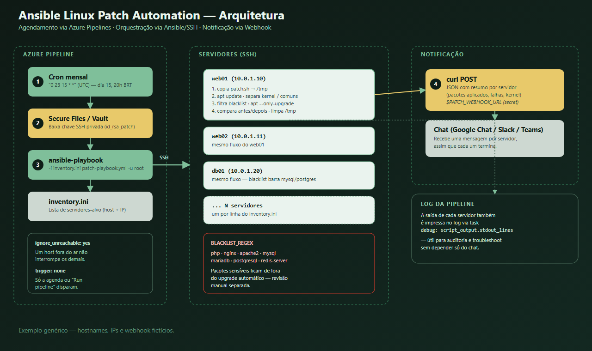

# Ansible Linux Patch Automation

Automação de **patch mensal de segurança** para servidores Linux, usando **Azure Pipelines** para agendamento/execução, **Ansible** para orquestração via SSH e um **script Bash** que aplica os updates e notifica o resultado em um canal de chat (Google Chat, Slack, Teams, etc.).

> Este repositório documenta o **padrão de arquitetura**, não uma implementação de produção específica. Todos os hostnames, IPs, URLs e credenciais abaixo são **exemplos fictícios** — substitua pelos valores reais do seu ambiente.



## Índice

- [Por que isso existe](#por-que-isso-existe)
- [Arquitetura](#arquitetura)
- [Estrutura do repositório](#estrutura-do-repositório)
- [1. Inventário dos servidores](#1-inventário-dos-servidores)
- [2. Pipeline (agendamento + orquestração)](#2-pipeline-agendamento--orquestração)
- [3. Playbook Ansible](#3-playbook-ansible)
- [4. Script de patch](#4-script-de-patch)
- [Fluxo de execução completo](#fluxo-de-execução-completo)
- [Comandos úteis / como testar](#comandos-úteis--como-testar)
- [Como adaptar para o seu ambiente](#como-adaptar-para-o-seu-ambiente)
- [Boas práticas de segurança](#boas-práticas-de-segurança)

## Por que isso existe

Manter dezenas de servidores Linux com patches de segurança em dia manualmente (`apt update && apt upgrade`) não escala e depende de disciplina humana. Este padrão resolve isso com:

- **Agendamento automático** (ex: todo dia 15 do mês) via cron da pipeline.
- **Execução idempotente e auditável** via Ansible, sem acesso interativo aos servidores.
- **Blacklist de pacotes sensíveis** (banco de dados, web server, PHP) para não quebrar aplicações em produção sem revisão manual.
- **Notificação automática** por servidor, com o que foi atualizado, o que falhou e se o kernel mudou.

## Arquitetura

```mermaid
flowchart LR
    A["Cron da Pipeline\n(mensal)"] --> B["Azure Pipeline"]
    B -->|baixa| C["Chave SSH\n(Secure Files / Vault)"]
    B --> D["ansible-playbook"]
    D -->|SSH| E1["Servidor 1"]
    D -->|SSH| E2["Servidor 2"]
    D -->|SSH| E3["Servidor N"]
    E1 --> F1["patch.sh"]
    E2 --> F2["patch.sh"]
    E3 --> F3["patch.sh"]
    F1 --> G["Webhook de Chat"]
    F2 --> G
    F3 --> G
```



## Estrutura do repositório

```
.
├── inventory.ini              # lista de servidores-alvo
├── patch.sh                   # script que roda dentro de cada servidor
├── patch-playbook.yml         # playbook Ansible que orquestra tudo
└── azure-pipelines.yml        # agendamento + bootstrap da execução
```

---

## 1. Inventário dos servidores

`inventory.ini` é um inventário estático do Ansible: um grupo com todos os hosts que devem receber o patch.

```ini
[vms_patch]
web01        ansible_host=10.0.1.10
web02        ansible_host=10.0.1.11
db01         ansible_host=10.0.1.20
proxy01      ansible_host=10.0.1.30
app-homolog  ansible_host=10.0.2.10
```

Adicionar ou remover um servidor do patch mensal é **apenas editar esta lista** — nenhuma outra parte do sistema precisa mudar.

**Pré-requisito:** cada servidor precisa ter a chave pública correspondente à chave privada usada pela pipeline cadastrada em `/root/.ssh/authorized_keys` (ou em um usuário com sudo, se preferir não usar root diretamente).

---

## 2. Pipeline (agendamento + orquestração)

`azure-pipelines.yml` faz três coisas: define quando rodar, prepara a credencial SSH e chama o Ansible.

```yaml
trigger: none  # não dispara em push, só pela agenda ou manualmente

schedules:
  - cron: "0 23 15 * *"   # minuto hora dia mês diaDaSemana — sempre em UTC
    displayName: "Patch mensal — dia 15, 20h BRT"
    branches:
      include: [main]
    always: true

pool:
  name: "self-hosted-pool"

variables:
  ansible_user: "root"

steps:
  - checkout: self

  - task: DownloadSecureFile@1
    name: sshKey
    displayName: "Baixar chave SSH privada"
    inputs:
      secureFile: "id_rsa_patch"

  - script: |
      # normaliza a chave (útil se ela foi editada/versionada no Windows) e ajusta permissão
      tr -d '\r' < $(sshKey.secureFilePath) > $(sshKey.secureFilePath)_clean
      mv $(sshKey.secureFilePath)_clean $(sshKey.secureFilePath)
      chmod 600 $(sshKey.secureFilePath)
    displayName: "Preparar chave SSH"

  - script: |
      sed -i 's/\r$//' inventory.ini
      export ANSIBLE_HOST_KEY_CHECKING=False

      ansible-playbook -i inventory.ini patch-playbook.yml \
        --private-key $(sshKey.secureFilePath) \
        -u $(ansible_user) \
        -vv
    displayName: "Rodar Ansible Playbook"
```

**Pontos-chave desse arquivo:**

- `trigger: none` + `schedules` → a única forma automática de disparo é o cron; um `git push` normal não roda a pipeline.
- A expressão cron do Azure Pipelines é sempre em **UTC**, no formato `minuto hora diaDoMês mês diaDaSemana`. Se você quer "dia 15, 20h no horário de Brasília (UTC-3)", o valor correto é `"0 23 15 * *"` — um erro comum é esquecer o offset de fuso horário aqui.
- A chave privada SSH **nunca é versionada no Git** — ela vive em *Secure Files* (Azure DevOps) ou em um cofre equivalente (Vault, AWS Secrets Manager, etc.) e é baixada em runtime.
- `ANSIBLE_HOST_KEY_CHECKING=False` evita prompts interativos de host key em uma execução não-interativa — só faz sentido numa rede interna confiável (veja a seção de boas práticas).

---

## 3. Playbook Ansible

`patch-playbook.yml` orquestra o que acontece em cada servidor: copia o script, executa, coleta o resultado e limpa.

```yaml
---
- name: Executar patch mensal com notificação
  hosts: all
  become: yes
  gather_facts: yes
  ignore_unreachable: yes   # um host fora do ar não derruba a execução dos demais

  tasks:
    - name: (Debian/Ubuntu) Corrigir chaves GPG expiradas de repositório
      apt_key:
        keyserver: keyserver.ubuntu.com
        id: "{{ item }}"
        state: present
      loop:
        - "3B4FE6ACC0B21F32"   # exemplo — troque pelas chaves que expiram no seu ambiente
        - "871920D1991BC93C"
      when: ansible_os_family == "Debian"
      ignore_errors: yes

    - name: Enviar script de patch para o servidor
      copy:
        src: patch.sh
        dest: /tmp/patch.sh
        mode: "0755"

    - name: Garantir formato Unix do script (remove CRLF)
      command: sed -i 's/\r$//' /tmp/patch.sh

    - name: Executar o script de patch
      command: /tmp/patch.sh
      register: patch_output

    - name: Mostrar resultado no log da pipeline
      debug:
        msg: "{{ patch_output.stdout_lines }}"

    - name: Remover o script do servidor
      file:
        path: /tmp/patch.sh
        state: absent
```

**Por que corrigir chaves GPG?** Em imagens Debian/Ubuntu mais antigas, chaves de repositório expiram e o `apt update` passa a falhar com `NO_PUBKEY <id>`. Reimportar a chave do keyserver antes do patch evita que isso bloqueie a atualização — mas é opcional e específico da sua distro/imagem base.

---

## 4. Script de patch

`patch.sh` é o script que efetivamente roda dentro do servidor. O nome "noexit" no script original não é por acaso: ele é desenhado para **nunca abortar no meio** — nenhum `exit`/`return`, cada comando arriscado termina em `|| true` — garantindo que o relatório final sempre seja montado e enviado, mesmo que uma etapa específica falhe.

```bash
#!/bin/bash
# patch.sh — aplica upgrades de segurança e notifica o resultado
# Não usa 'exit' nem 'return' — termina naturalmente, sempre enviando o relatório.
set -uo pipefail
IFS=$'\n\t'

# --- CONFIGURAÇÃO ---
# Em produção, isso NÃO deve estar hardcoded — veja "Boas práticas de segurança"
WEBHOOK_URL="${PATCH_WEBHOOK_URL:-https://chat.example.com/webhook/EXEMPLO}"

# Pacotes que nunca devem ser atualizados automaticamente
# (mude para os pacotes sensíveis do seu ambiente: web server, banco, runtime de app, etc.)
BLACKLIST_REGEX='^(php|nginx|apache2|mysql|mariadb|postgresql|redis-server)'

# Modo não-interativo: evita prompts de configuração de pacote e do 'needrestart'
# (que pergunta quais serviços reiniciar após um upgrade de lib compartilhada)
export DEBIAN_FRONTEND=noninteractive
export NEEDRESTART_MODE=a
export NEEDRESTART_SUSPEND=1

# --- COLETA DE DADOS DO SISTEMA ---
HOST="$(hostname -f 2>/dev/null || hostname)"
IP="$(hostname -I 2>/dev/null | awk '{print $1}' || echo 'N/A')"
ARQUITETURA="$(uname -m)"
SO="$(grep -E '^PRETTY_NAME=' /etc/os-release | cut -d '"' -f 2 || echo 'Linux Desconhecido')"
KERNEL_ANTES="$(uname -r)"
DATA_HORA="$(date -u +'%Y-%m-%dT%H:%M:%SZ')"
START=$(date +%s)

if [ "$(id -u)" -ne 0 ]; then
    echo "Execute como root (sudo)." >&2
else
    apt update >/dev/null 2>&1 || true

    mapfile -t UPGRADABLE_ALL < <(apt list --upgradable 2>/dev/null | awk -F/ 'NR>1 {print $1}')
    PENDENTES_COUNT=${#UPGRADABLE_ALL[@]}

    if [ "$PENDENTES_COUNT" -eq 0 ]; then
        STATUS="NENHUMA ATUALIZAÇÃO"
        SUCESSO="NÃO"
        KERNEL_DEPOIS="$KERNEL_ANTES"
        KERNEL_ALTERADO="NÃO"
        TOTAL_APLICADAS=0
        TOTAL_FALHAS=0
    else
        STATUS="ATUALIZADO"

        # separa pacotes de kernel dos demais
        mapfile -t KERNEL_BEFORE < <(printf '%s\n' "${UPGRADABLE_ALL[@]}" | grep -E '^linux-(image|headers|generic)' || true)
        mapfile -t COMMON_CANDIDATES < <(printf '%s\n' "${UPGRADABLE_ALL[@]}" | grep -v -E '^linux-(image|headers|generic)' || true)

        # remove os pacotes da blacklist
        ALLOWED_COMMON=()
        for pkg in "${COMMON_CANDIDATES[@]}"; do
            printf '%s\n' "$pkg" | grep -Eq "$BLACKLIST_REGEX" || ALLOWED_COMMON+=("$pkg")
        done

        # ---- aplica pacotes comuns e verifica, um a um, quais realmente saíram da lista de pendentes ----
        COMMON_APPLIED=(); COMMON_FAILED=()
        if [ "${#ALLOWED_COMMON[@]}" -gt 0 ]; then
            apt install --only-upgrade -y "${ALLOWED_COMMON[@]}" >/tmp/patch_common.apt.log 2>&1 || true
            mapfile -t COMMON_AFTER < <(apt list --upgradable 2>/dev/null | awk -F/ 'NR>1 {print $1}')
            for pkg in "${ALLOWED_COMMON[@]}"; do
                printf '%s\n' "${COMMON_AFTER[@]}" | grep -qx "$pkg" && COMMON_FAILED+=("$pkg") || COMMON_APPLIED+=("$pkg")
            done
        fi

        # ---- mesma lógica de antes/depois para o kernel ----
        KERNEL_APPLIED=(); KERNEL_FAILED=()
        if [ "${#KERNEL_BEFORE[@]}" -gt 0 ]; then
            apt install --only-upgrade -y "${KERNEL_BEFORE[@]}" >/tmp/patch_kernel.apt.log 2>&1 || true
            mapfile -t KERNEL_AFTER < <(apt list --upgradable 2>/dev/null | awk -F/ 'NR>1 {print $1}' | grep -E '^linux-(image|headers|generic)' || true)
            for pkg in "${KERNEL_BEFORE[@]}"; do
                printf '%s\n' "${KERNEL_AFTER[@]}" | grep -qx "$pkg" && KERNEL_FAILED+=("$pkg") || KERNEL_APPLIED+=("$pkg")
            done
        fi

        TOTAL_APLICADAS=$(( ${#COMMON_APPLIED[@]} + ${#KERNEL_APPLIED[@]} ))
        TOTAL_FALHAS=$(( ${#COMMON_FAILED[@]} + ${#KERNEL_FAILED[@]} ))
        [ "$TOTAL_APLICADAS" -gt 0 ] && SUCESSO="SIM" || SUCESSO="NÃO"

        # kernel só "mudou de verdade" se o pacote aplicou E a versão em /boot é diferente da que estava rodando
        KERNEL_DEPOIS="$(ls -1t /boot/vmlinuz-* 2>/dev/null | head -n1 | sed 's|/boot/vmlinuz-||' || echo "$KERNEL_ANTES")"
        if [ "${#KERNEL_APPLIED[@]}" -gt 0 ] && [ "$KERNEL_ANTES" != "$KERNEL_DEPOIS" ]; then
            KERNEL_ALTERADO="SIM"
        else
            KERNEL_ALTERADO="NÃO"
            KERNEL_DEPOIS="$KERNEL_ANTES"
        fi
    fi

    END=$(date +%s)
    ELAPSED=$((END - START))

    MSG="Servidor: $HOST ($IP) | SO: $SO ($ARQUITETURA) | Data: $DATA_HORA
Status: $STATUS | Pendentes: $PENDENTES_COUNT | Aplicados: $TOTAL_APLICADAS | Falhas: $TOTAL_FALHAS
Kernel: $KERNEL_ANTES -> $KERNEL_DEPOIS (Alterado: $KERNEL_ALTERADO) | Tempo: ${ELAPSED}s"

    # escapa a mensagem como string JSON válida antes de enviar (evita quebrar o payload
    # se algum nome de pacote ou linha tiver aspas/caracteres especiais)
    if command -v python3 >/dev/null 2>&1; then
        ESCAPED=$(printf '%s' "$MSG" | python3 -c 'import sys,json; print(json.dumps(sys.stdin.read()))')
        curl -sS -X POST -H "Content-Type: application/json" -d "{\"text\": $ESCAPED}" "$WEBHOOK_URL" >/dev/null 2>&1 || true
    else
        # fallback simples caso o servidor não tenha python3 instalado
        curl -sS -X POST -H "Content-Type: application/json" -d "{\"text\":\"${MSG//\"/\\\"}\"}" "$WEBHOOK_URL" >/dev/null 2>&1 || true
    fi

    printf '%s\n' "$MSG"
fi
```

**Lógica principal, passo a passo:**

1. **Modo não-interativo** — além do clássico `DEBIAN_FRONTEND=noninteractive`, o script também neutraliza o `needrestart` (`NEEDRESTART_MODE=a`, `NEEDRESTART_SUSPEND=1`), que em servidores modernos com Debian/Ubuntu abre um prompt interativo perguntando quais serviços reiniciar após atualizar uma lib compartilhada (`libssl`, `libc6`, etc.) — sem isso, o `apt` trava esperando input em uma execução não-interativa.
2. **Coleta de contexto do servidor** — hostname, IP, arquitetura (`uname -m`), nome bonito do SO (`PRETTY_NAME` do `/etc/os-release`) e o kernel em execução, tudo isso vai para o relatório final.
3. `apt update` e lista de pendentes (`apt list --upgradable`).
4. Separa em **kernel** (`linux-image`, `linux-headers`, ...) e **demais pacotes**, removendo da segunda lista tudo que bate com a **blacklist**.
5. Aplica `apt install --only-upgrade`, redirecionando a saída para um log em `/tmp` (`patch_common.apt.log` / `patch_kernel.apt.log`) — útil para investigar uma falha específica direto no servidor, já que o relatório do chat não inclui o log completo.
6. **Verificação pacote a pacote**: em vez de confiar no código de saída do `apt` (que pode retornar sucesso mesmo com um pacote individual falho), o script compara a lista de pendentes *antes* e *depois* — um pacote que some da lista foi aplicado; um que continua lá é contado como falha. Isso alimenta os contadores `TOTAL_APLICADAS`/`TOTAL_FALHAS`.
7. **Kernel "alterado" tem duas condições**, não uma: o pacote de kernel precisa ter sido aplicado com sucesso **e** a versão mais recente em `/boot` precisa ser diferente da que estava rodando (`uname -r` antes). Isso evita reportar "kernel alterado" quando, por exemplo, o pacote já estava na versão mais recente disponível em disco.
8. Monta a mensagem final com todos os campos e mede o tempo total de execução (`START`/`END`).
9. **Escapa a mensagem como JSON de verdade** (via `python3 -c 'json.dumps(...)'`) antes de montar o payload do webhook — evita quebrar a requisição se um nome de pacote ou uma variável tiver aspas ou caractere especial; há um fallback manual de escaping caso o servidor não tenha `python3`.
10. Envia por `curl -X POST` e também imprime a mensagem no stdout, capturado pelo Ansible/pipeline — assim o resultado fica visível tanto no chat quanto no log da execução.

> ⚠️ **Kernel atualizado ≠ kernel em uso.** Mesmo com a checagem dupla acima, instalar um novo pacote de kernel não faz o servidor rodar nele — isso só acontece após um **reboot**. Se seu processo não reinicia os servidores automaticamente, decida separadamente como/quando fazer isso (janela de manutenção, reboot escalonado, etc.).

> 💡 **Por que comparar antes/depois em vez de checar o código de saída do apt?** Um `apt install --only-upgrade pacote1 pacote2 pacote3` pode retornar código de saída 0 (sucesso) mesmo que um dos três pacotes tenha falhado por um motivo pontual (repositório temporariamente indisponível, conflito de dependência). Comparar a lista de upgradable antes/depois pega isso por pacote individual, não só o resultado agregado do comando.

---

## Fluxo de execução completo

1. O cron da pipeline dispara (ou alguém clica em "Run pipeline").
2. A pipeline baixa e prepara a chave SSH.
3. `ansible-playbook` conecta em cada host do inventário.
4. Em cada host: corrige GPG (se aplicável) → copia o script → executa → captura a saída → remove o script.
5. Dentro do script: `apt update` → separa kernel/comuns → filtra blacklist → aplica upgrade → compara antes/depois → notifica.
6. A pipeline segue para o próximo host, independente do resultado do anterior.

## Comandos úteis / como testar

Exemplos práticos para validar o playbook antes de deixar o cron rodar sozinho.

**Testar conectividade SSH com todos os servidores do inventário:**
```bash
ansible all -i inventory.ini -m ping -u root --private-key ~/.ssh/id_rsa_patch
```

**Checar a sintaxe do playbook (sem conectar em nada):**
```bash
ansible-playbook -i inventory.ini patch-playbook.yml --syntax-check
```

**Listar quais hosts o playbook alcançaria, sem executar nada:**
```bash
ansible-playbook -i inventory.ini patch-playbook.yml --list-hosts
```

**Rodar em modo *dry-run* (não aplica mudanças, só mostra o que faria):**
```bash
ansible-playbook -i inventory.ini patch-playbook.yml --check --diff \
  -u root --private-key ~/.ssh/id_rsa_patch
```
> ⚠️ `--check` tem efeito limitado aqui: as tasks `command`/`shell` (como a que roda o `patch.sh`) não sabem simular — o Ansible só reporta que *pularia* essas tasks em check mode, não o que o script faria de fato.

**Rodar de verdade, mas limitado a um único servidor (útil para validar um host novo antes de incluir todo mundo):**
```bash
ansible-playbook -i inventory.ini patch-playbook.yml --limit web01 \
  -u root --private-key ~/.ssh/id_rsa_patch -vv
```

**Rodar o script de patch direto via SSH, sem passar pelo Ansible (debug rápido):**
```bash
ssh -i ~/.ssh/id_rsa_patch root@web01 'bash -s' < patch.sh
```

**Lint do playbook (boas práticas / erros comuns):**
```bash
pip install ansible-lint
ansible-lint patch-playbook.yml
```

**Disparar a pipeline manualmente via Azure CLI, sem passar pela interface web:**
```bash
az pipelines run --name "Ansible-Patch-Mensal-Linux" --branch main
```

**Ver as últimas execuções da pipeline e seus resultados:**
```bash
az pipelines runs list --pipeline-name "Ansible-Patch-Mensal-Linux" --top 10 \
  --query "[].{data:queueTime, resultado:result}" -o table
```

## Como adaptar para o seu ambiente

- **Distro diferente de Debian/Ubuntu?** Troque a lógica de `apt` por `dnf`/`yum` (RHEL/CentOS/Fedora) ou `zypper` (SUSE) — a estrutura de separar kernel/comuns e aplicar blacklist continua igual.
- **Sem acesso root direto?** Troque `become: yes` + usuário root por um usuário com `sudo` e ajuste o script para chamar os comandos `apt`/`dnf` com `sudo`.
- **Outro canal de notificação?** O `curl` no final do script é o único ponto que fala com o Google Chat — troque a URL e o formato do JSON pelo webhook do Slack, Teams, Discord, etc.
- **Quer limitar uma execução manual a poucos hosts?** Adicione um parâmetro de pipeline (`target_limit`) e passe `--limit "$(target_limit)"` para o `ansible-playbook`.

## Boas práticas de segurança

- **Nunca hardcode webhooks, tokens ou senhas no script.** Use variável de ambiente injetada pela pipeline a partir de um cofre de segredos (Secure Files, Key Vault, GitHub Actions Secrets, etc.) — no exemplo acima isso já está preparado via `${PATCH_WEBHOOK_URL:-...}`.
- **Evite `ANSIBLE_HOST_KEY_CHECKING=False` em redes não confiáveis** — em uma rede interna controlada é uma troca aceitável de conveniência por segurança, mas vale documentar essa decisão.
- **Tenha uma blacklist revisada por quem conhece as aplicações** — pacotes como banco de dados e web server merecem atualização manual com testes, não upgrade automático silencioso.
- **Separe produção de homologação** se o seu ambiente tiver as duas — um padrão comum é ter uma flag de "janela de manutenção" que libera pacotes de maior impacto (kernel, DB) apenas quando explicitamente autorizado.

---

*Este documento descreve um padrão de automação genérico, inspirado em um caso de uso real, mas com todos os dados específicos de ambiente substituídos por exemplos.*
